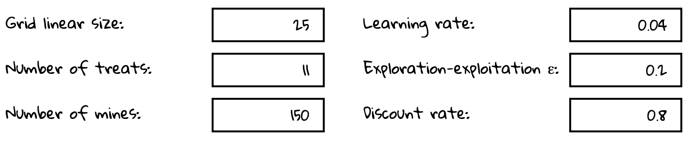
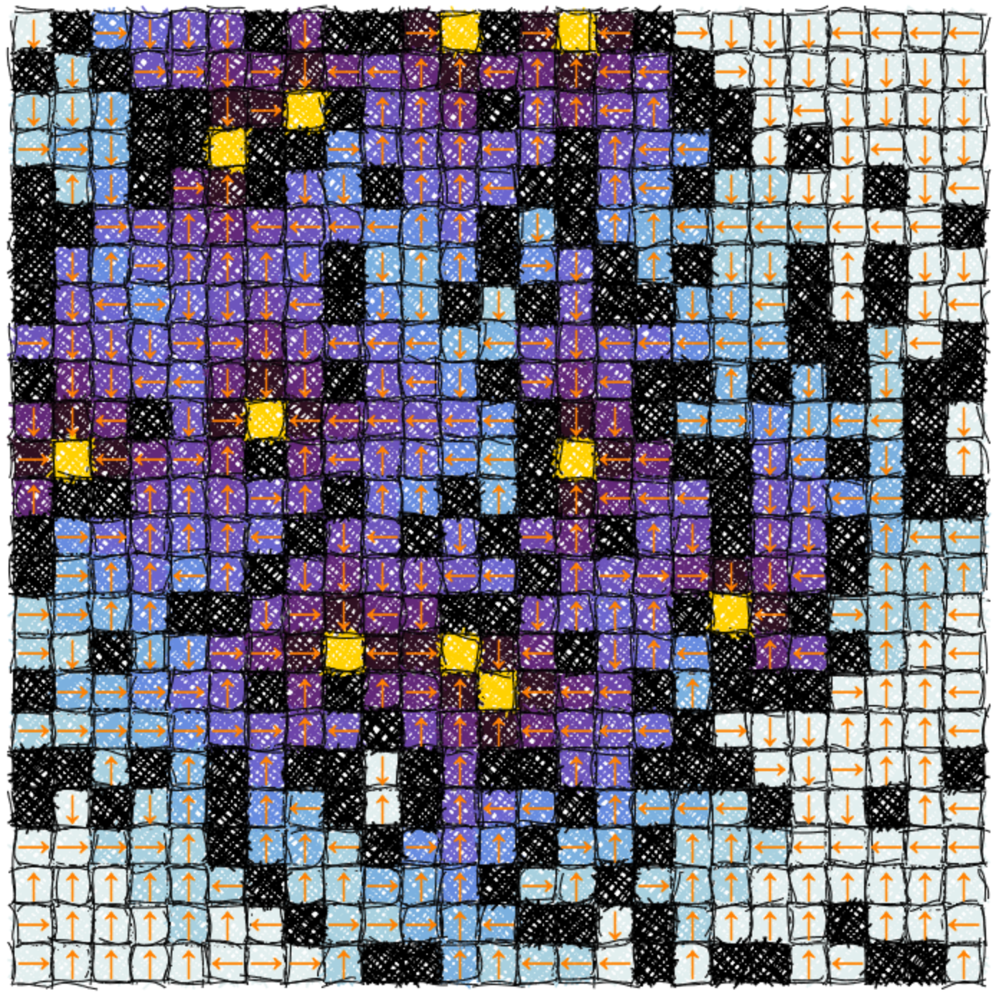

# Reinforcement Learning Grid Walker

[Reinforcement learning](https://en.wikipedia.org/wiki/Reinforcement_learning) toy model of a walker on a two-dimensional grid. The task is to avoid the mines (negative rewards, penalties) while reaching the treats (positive rewards and fixed points).

The learning algorithm used is the canonical [Q-learning](https://en.wikipedia.org/wiki/Q-learning).

The user can play with different hyperparameters such as the learning rate, reward forecast discount, exploration-exploitation trade-off on grids of varying size and different reward/penalty densities.

The panel of settings:



The grid and the learned policy can be visualized.



------

This project was generated with [Angular 7](https://github.com/angular/angular-cli), and visualization uses [roughjs](https://github.com/pshihn/rough).


------


Play with me [here](https://vnherdeiro.github.io/rl-grid-walker/), or locally:

Build dependencies with:
```
npm install
```
then run with
```
ng serve
```